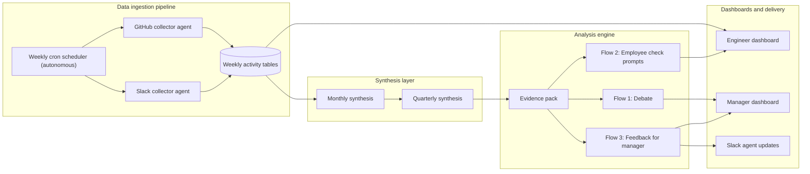

# PRFRD

PRFRD is an autonomous agent platform for weekly engineering signal ingestion, manager analysis, and role-based dashboards.

## What ships in this MVP

- Weekly GitHub and Slack activity model in Postgres
- Monthly and quarterly synthesis generation from weekly signals
- Manager analysis orchestration with evidence-backed outputs
- Engineer and manager dashboards with drill-down views
- Slack delivery paths for agent updates (bot token or webhooks)

## Architecture

### Data ingestion pipeline (autonomous + weekly cron)

Every week, autonomous collector agents ingest collaboration and delivery signals from GitHub and Slack into normalized weekly tables.

- GitHub collector agent writes to `github_weekly_activity`
- Slack collector agent writes to `slack_weekly_activity`
- A weekly cron scheduler triggers ingestion
- Ingested data becomes the source for synthesis and analysis runs

MVP implementation note: local development currently uses seeded weekly snapshots as the ingestion simulator (`npm run db:seed` and `npm run db:seed:eve`).

### Analysis engine (three parallel agent flows)

Once monthly and quarterly evidence exists, the analysis engine fans out into three parallel agent flows:

1. Debate
   - Advocate and examiner agents produce opposing evidence-backed positions.
2. Employee check prompts
   - Agent generates employee-facing check-in prompts by theme.
3. Feedback for the manager
   - Agent generates manager coaching guidance and follow-up prompts.

Analysis artifacts are persisted in:

- `analysis_run`
- `analysis_debate_response`
- `analysis_arbiter_decision`
- `employee_prompt`
- `manager_feedback`

### Dashboard features

- Role-based entry point for engineer and manager workspaces
- Engineer dashboard
  - Weekly activity cards from GitHub and Slack signals
  - Monthly summary cards
  - "Generate monthly report" action
  - "Recheck stats" assistant request flow
- Manager dashboard
  - Team KPI rollups (PRs, reviews, messages, replies)
  - Risk flags (after-hours load, blockers, weekend load)
  - Engineer-level drill-down pages
  - Debate conversation panel backed by persisted agent responses



## Local setup

### Prerequisites

- Node.js 20+
- npm 10+
- PostgreSQL connection string (Neon works out of the box)
- OpenAI API key
- Slack app credentials (only needed for Slack delivery routes)

### 1) Install dependencies

```bash
npm install
```

### 2) Configure environment

Create `/Users/hanzo/prfrd/.env.local`:

```bash
DATABASE_URL=
OPENAI_API_KEY=

# Optional model tuning
OPENAI_MODEL=gpt-5.1
OPENAI_MODEL_VERSION=unspecified
INSIGHT_LLM_MIN_INTERVAL_MS=30000
MANAGER_ANALYSIS_LLM_MIN_INTERVAL_MS=30000

# Slack app credentials (API path)
SLACK_APP_ID=
SLACK_CLIENT_ID=
SLACK_CLIENT_SECRET=
SLACK_SIGNING_SECRET=
SLACK_VERIFICATION_TOKEN=
SLACK_APP_TOKEN=
SLACK_BOT_TOKEN=

# Slack webhook credentials (optional)
SLACK_WEBHOOK_ALICE_URL=
SLACK_WEBHOOK_BOB_URL=
SLACK_WEBHOOK_EVE_URL=
SLACK_WEBHOOK_MANAGER_URL=
```

### 3) Apply schema and seed weekly data

```bash
npm run db:push
npm run db:seed
```

### 4) Start the app

```bash
npm run dev
```

Open [http://localhost:3000](http://localhost:3000).

## Autonomous weekly ingestion via cron (local)

For local demos, cron can run the ingestion simulator weekly so dashboards always have fresh weekly snapshots.

1. Create log directory:

```bash
mkdir -p /Users/hanzo/prfrd/.cron-logs
```

2. Open crontab:

```bash
crontab -e
```

3. Add weekly autonomous ingestion (every Monday at 6:00 AM local time):

```cron
0 6 * * 1 cd /Users/hanzo/prfrd && /usr/bin/env npm run db:seed >> /Users/hanzo/prfrd/.cron-logs/weekly-ingestion.log 2>&1
```

Production swap-in: replace `npm run db:seed` with your live GitHub and Slack collectors, keeping the same schedule shape.

## Run analysis workflows

### Generate monthly and quarterly insights

```bash
curl -sS -X POST http://localhost:3000/api/insights/generate-report \
  -H 'Content-Type: application/json' \
  -d '{"employeeEmail":"alice@company.com"}'
```

### Generate manager analysis for a quarter

```bash
curl -sS -X POST http://localhost:3000/api/insights/generate-manager-analysis \
  -H 'Content-Type: application/json' \
  -d '{"employeeEmail":"alice@company.com","quarter":"2025-Q4","monthKeys":["2025-10","2025-11","2025-12"]}'
```

## Command reference

- `npm run dev` - start local Next.js server
- `npm run build` - create production build
- `npm run start` - run production server
- `npm run lint` - run ESLint
- `npm run db:generate` - generate Drizzle migrations
- `npm run db:push` - apply schema changes to database
- `npm run db:seed` - seed full local MVP dataset
- `npm run db:seed:eve` - append/update only Eve data
